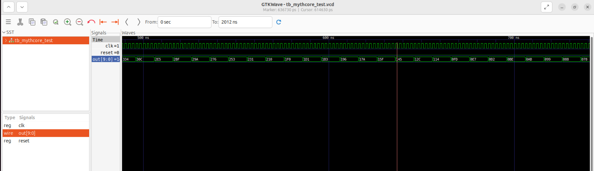
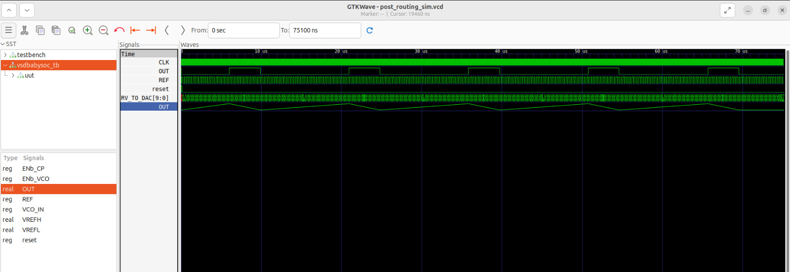

# BabySoC Functional Flow: From RTL to Gate-Level Verification  

This repository captures the design and verification journey of the **VSD BabySoC** –  
a small but complete System-on-Chip (SoC) built using open-source tools.  
It integrates:  
- `rvmyth` → a RISC-V CPU core  
- `avsddac` → Digital-to-Analog Converter  
- `avsdpll` → Phase-Locked Loop  

The project demonstrates **RTL-to-Gate flow** with both **pre-synthesis** and **post-synthesis verification**.

---

## 📌 Objectives  

<!-- Why this project is useful -->
- Build a strong foundation in **SoC fundamentals**  
- Practice **functional modeling and verification** of BabySoC  
- Convert RTL to a **gate-level netlist** with the SkyWater 130nm library  
- Verify that **post-synthesis GLS = original RTL behavior**  

---

## 🔧 Tools & Setup  

<!-- Tools required -->
- **Yosys** → Logic synthesis  
- **Icarus Verilog** → Simulation  
- **GTKWave** → Waveform visualization  
- **Sandpiper** → Convert TL-Verilog to Verilog for `rvmyth`  

 Command for Sandpiper:  
```bash
pip3 install pyyaml click sandpiper-saas
sandpiper-saas -i ./src/module/*.tlv -o rvmyth.v --bestsv --noline -p verilog --outdir ./src/module/
```
This generates rvmyth.v, which is used in synthesis and simulation.


---
## 🖥️ Workflow
### 1. RTL Simulation (Pre-Synthesis)
<!-- Pre-synthesis RTL check -->
Run RTL simulation with Icarus Verilog:

```bash
iverilog -o output/pre_synth_sim/pre_synth_sim.out -DPRE_SYNTH_SIM src/module/testbench.v -I src/include -I src/module
cd output/pre_synth_sim
./pre_synth_sim.out
gtkwave pre_synth_sim.vcd
```

✔ Confirms CPU writes to DAC & PLL locks properly.


### 2. Synthesis with Yosys
<!-- RTL -> Gate level -->
Analog IPs are black-boxed using stubs.

#### `src/module/avsddac_stub.v`

```verilog
// Stub module for the avsddac analog IP.
// This is a black box for synthesis. Do not add logic here.

module avsddac (
   output OUT,
   input [9:0] D,
   input VREFH,
   input VREFL
);

// Intentionally empty

endmodule
```

#### `src/module/avsdpll_stub.v`

```verilog
// Stub module for the avsdpll analog IP.
// This is a black box for synthesis. Do not add logic here.

module avsdpll (
   output reg  CLK,
   input  wire VCO_IN,
   input  wire ENb_CP,
   input  wire ENb_VCO,
   input  wire REF
);

// Intentionally empty

endmodule
```

#### Run synthesis:
```bash
read_liberty -lib src/lib/sky130_fd_sc_hd__tt_025C_1v80.lib
read_liberty -lib src/lib/avsddac.lib
read_liberty -lib src/lib/avsdpll.lib
read_verilog src/module/vsdbabysoc.v
read_verilog -I src/include src/module/rvmyth.v
read_verilog -I src/include src/module/clk_gate.v
read_verilog src/module/avsddac_stub.v
read_verilog src/module/avsdpll_stub.v
synth -top vsdbabysoc
dfflibmap -liberty src/lib/sky130_fd_sc_hd__tt_025C_1v80.lib
opt
abc -liberty src/lib/sky130_fd_sc_hd__tt_025C_1v80.lib
flatten
setundef -zero
clean -purge
rename -enumerate
write_verilog -noattr VSDBabySoC/src/module/vsdbabysoc_netlist.v
stat -liberty src/lib/sky130_fd_sc_hd__tt_025C_1v80.lib
show vsdbabysoc
```

✔ Produces gate-level netlist → reportsVSDBabySoC/src/module/vsdbabysoc_netlist.v


### 3. Gate-Level Simulation (GLS)
<!-- Post-synthesis verification -->
Simulate synthesized netlist:

```bash
iverilog -DFUNCTIONAL -DUNIT_DELAY=#1   -I src/gls_model   -o output/post_synth_sim/post_synth_sim.out   src/module/testbench.rvmyth.post-routing.v src/module/testbench.v  src/gls_model/primitives.v   src/gls_model/sky130_fd_sc_hd.v   output/synthesized/vsdbabysoc.synth.v   src/module/avsdpll.v   src/module/avsddac.v
cd output/post_synth_sim
./post_synth_sim.out
gtkwave dump.vcd
```

✔ GLS waveform = RTL waveform → functional equivalence verified.


---
## 📊 Results
✅ RTL simulation successful

✅ Synthesized netlist generated

✅ Identical waveforms in RTL & GLS

---
## 🚀 Conclusion
This project provides a complete RTL-to-GLS verification flow for BabySoC.
The results confirm that the design is functionally sound and ready for Physical Design (PnR).

---
